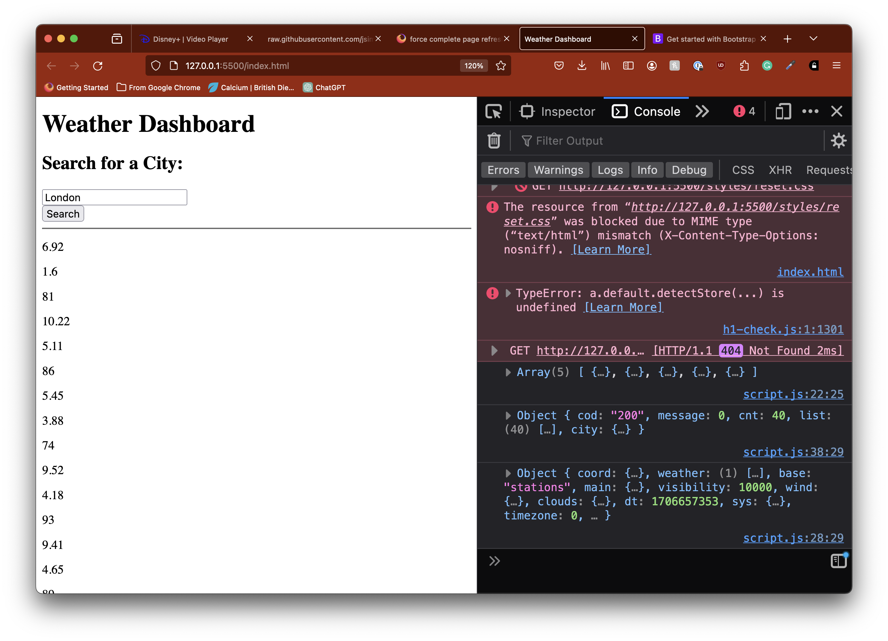

# magic-weatherboard
Get the weather forecast for the next 5 days of your chosen location.

## Description

Magic weatherboard uses jQuery and the weather api to fetch data of wind, humidity and the forecast for any city.

## Table of Contents

N/A

## Installation

N/A

## Usage

Users can type in any city and data displaying the humidity, wind and forecast will appear. The unit of measurement was converted.

I tested the function by changing the currentTime variable value in the timeBlocks function to 11AM, now I can see how the css style applies to the planner.

## Features

JavaScript

jQuery

HTML

CSS

Fetch API
