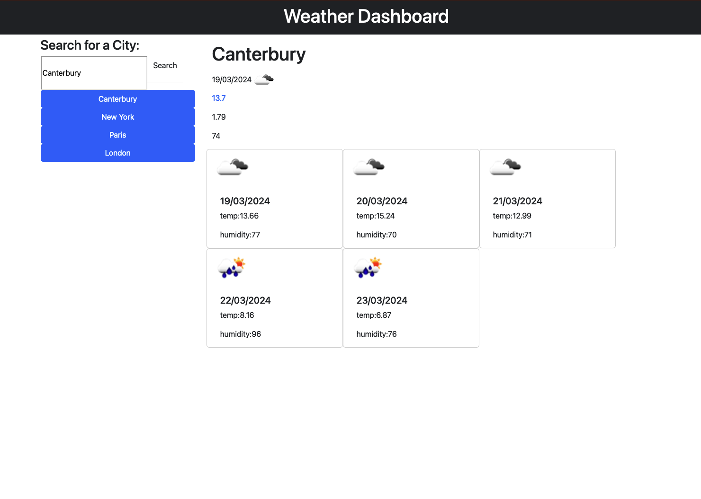

# magic-weatherboard
Get the weather forecast for the next 5 days of your chosen location.

## Description

Magic weatherboard uses jQuery and the weather api to fetch data of wind, temp, humidity for any city on the current day as well the forecast for the next five days.

## Table of Contents

N/A

## Installation

N/A

## Usage

Users can type in any city and data displaying the humidity, wind and forecast will appear. The unit of measurement is converted to metrics, when the user has searched for a city they can view the forecast for the next 5 days including the weather for today, when the user searches for a new location the old search is stored in a list for the user to go back to whenever they want.

## Features

JavaScript

jQuery

HTML

CSS

Fetch API
